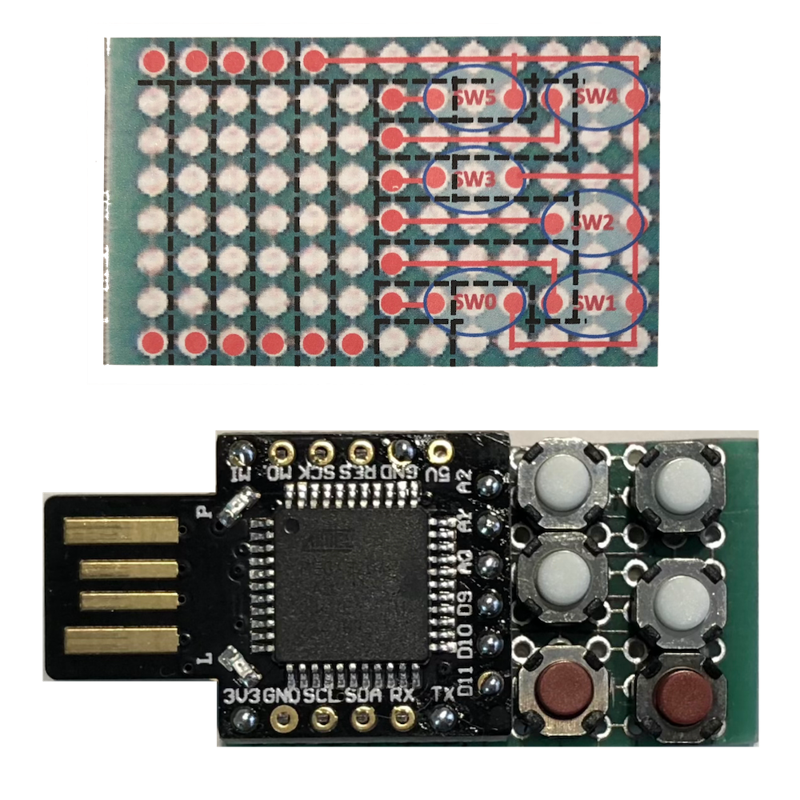

# Beetle_ATMEGA32U4 Projetcs

| プロジェクト | 目的 | 備考 |
|:--|:--|:--|
| [sketch_switch](sketch_switch.zip) | スイッチのテスト | 押されたスイッチに対応した文字列"SW0"〜"SW5"をキーボード送出する |
| [sketch_IdPass6](sketch_IdPass6.zip) | 1アクション目SW0、2アクション目SW1〜SW5に対応した文字列を送出する | 15秒ごとのスリープブロッカー機能付き |

## 前提

- タクトスイッチを6個搭載したボードを前提とする

- 回路図と完成ボードの画像を以下に示す

両面スルーホール十字基板を使用。黒線が十字を切断する箇所。赤線が導通している回路を示す。SW0〜SW5はタクトスイッチの配置を示す。

