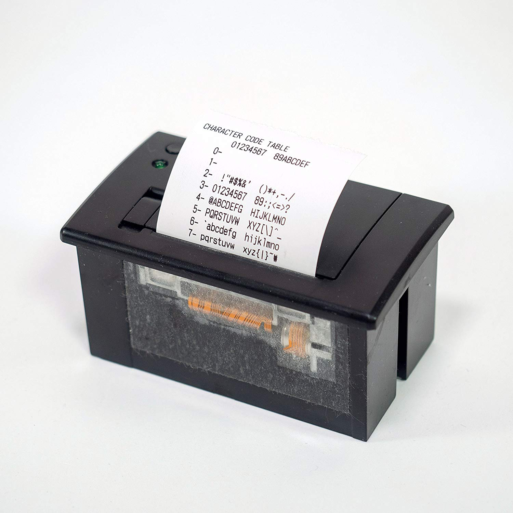
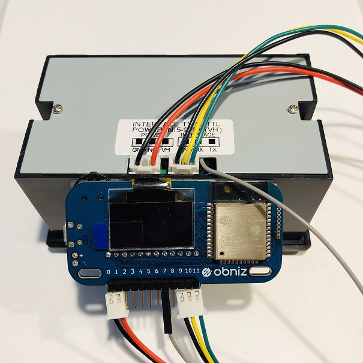
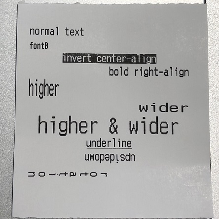
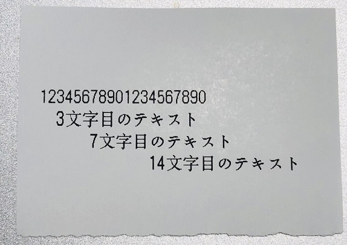
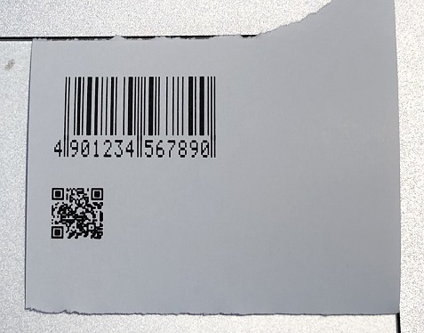

# DP-EH600

DP-EH600はobnizからUARTインタフェースで出力できるサーマルプリンタです。感熱ロール紙を使用します。

アプリケーションから簡単にこのプリンタを使うためのobnizパーツライブラリの説明です。




## obnizとの接続

DP-EH600の電源と信号線の両方のコネクタをobnizに接続します。DP-EH600のコネクタはメスのため、obnizに[両端オスのピンヘッド](http://akizukidenshi.com/catalog/g/gC-09056/)を挿すと接続が便利です。



もし、プリンタからRTS信号を引き出している場合は、この信号線もobnizに接続します。


## wired(vcc, gnd, tx, rx , gnd2, baud {, cts})

| name | color | required | description                          |
| :--- | :---: | :------: | ------------------------------------ |
| vcc  |  赤   |   任意   | 電源線（プラス）                     |
| gnd  |  黒   |   任意   | 電源線（マイナス）                   |
| tx   |  黄   |   必須   | RX線（プリンタのRXをobnizのTXへ）    |
| rx   |  緑   |   必須   | TX線（プリンタのTXをobnizのRXへ）    |
| gnd2 |  黒   |   必須   | GND線                                |
| cts  | 灰色  |   任意   | RTS線（プリンタのRTSをobnizのCTSへ） |
| baud |   -   |   必須   | 通信速度（ボーレート）               |

- プリンタの電源を別で供給する場合は、`vcc`と`gnd`は省略します。
- プリンタからRTS信号を引き出していない場合は、`cts`は省略します。
- 通信速度はプリンタに設定されているボーレートを指定します。テストプリントするとボーレートを確認することができます。

```javascript
//Javascript
const pr = obniz.wired('DPEH600', {gnd:0, vcc:1, gnd2:9, tx:10, rx:11, baud:115200, cts:7});
pr.init();
```


##  init({heatedPoint, heatTime, heatInterval})

プリンタを初期化します。引数にサーマルヘッド関係のパラメタを指定します。省略可すると下記のデフォルト値を設定します。

| name         | description                              | required | default |
| ------------ | ---------------------------------------- | :------: | :-----: |
| heatedPoint  | ヘッドの加熱一回あたりに印刷するドット数 |   任意   |    5    |
| heatTime     | ヘッドの加熱時間                         |   任意   |   100   |
| heatInterval | ヘッド加熱間隔                           |   任意   |   40    |

```javascript
//Javascript
const pr = obniz.wired('DPEH600', {gnd:0, vcc:1, gnd2:9, tx:10, rx:11, baud:115200, cts:7});
pr.init({heatedPoint:5, heatTime:100, heatInterval:40});
```


## printText(msg) ／ printText([msg, msg, ...])

引数に指定した文字列を印刷します。配列で複数の文字列を指定すると、各文字列ごとに改行して印刷します。

```javascript
//Javascript
pr.printText('テキストを印刷します');
pr.printText(['1行目のテキスト', '2行目のテキスト', '3行目のテキスト']);
```


## setPrintMode(mode)

印刷するテキストを修飾します。

| name       | description                                                  |
| ---------- | ------------------------------------------------------------ |
| fontB      | font-Bを使用する場合にtrue。falseまたは省略するとfont-Aを使用します。<br />・font-A：12 x 24<br />・font-B：9 x 17 |
| invert     | 白抜き文字（背景黒）を使用する場合にtrue。falseまたは省略すると通常の印字。 |
| bold       | ボールド（太文字）を使用する場合にtrue。falseまたは省略すると通常の印字。 |
| higher     | 縦2倍のフォントを使用する場合にtrue。falseまたは省略すると通常の印字。 |
| wider      | 横2倍のフォントを使用する場合にtrue。falseまたは省略すると通常の印字。<br />higherとwiderの両方にtrueを指定すると4倍のフォントになる。 |
| deleteline | 打ち消し線を使用する場合にtrue。falseまたは省略すると通常の印字。<br />（**何故か機能しない**） |
| underline  | アンダーライン下線）を使用する場合にtrue。falseまたは省略すると通常の印字。 |
| align      | 'L'を指定するか省略すると、左寄せで印字する。<br />'C'を指定すると、中央寄せで印字する。<br />'R'を指定すると、右寄せで印字する。 |
| upsidedown | 天地逆に印刷する場合にtrue。falseまたは省略すると通常の印字。<br />（この場合、alignの'L'と'R'も逆になる） |
| rotation   | 右に90°回転して印刷する場合にtrue。falseまたは省略すると通常の印字。 |

```javascript
//Javascript
pr.setPrintMode();
pr.printText("normal text");

pr.setPrintMode({fontB:true});
pr.printText("fontB");

pr.setPrintMode({invert:true, align:'C'});
pr.printText("invert center-align");

pr.setPrintMode({bold:true, align:'R'});
pr.printText("bold right-align");

pr.setPrintMode({higher:true, wider:false});
pr.printText("higher");

pr.setPrintMode({higher:false, wider:true, align:'R'});
pr.printText("wider");

pr.setPrintMode({higher:true, wider:true, align:'C'});
pr.printText("higher & wider");

pr.setPrintMode({underline:true, align:'C'});
pr.printText("underline");

pr.setPrintMode({upsidedown:true, align:'C', underline:false});
pr.printText("upsidedown");

pr.setPrintMode({rotation:true});
pr.printText("noitator");
pr.setPrintMode();
```




## linefeed({number})

紙を送ります。引数に改行数を指定します。省略時は1行分の紙を送ります。

```javascript
//Javascript
pr.printText('テキスト');
pr.linefeed(2); //2行分の紙送り
```


## setTabs(tabs)

タブコードの水平位置を配列で指定します。タブコード`'\t'`を使用しない場合は設定の必要はありません。

例）タブ位置を3文字目、7文字目、15文字目とする場合、`[2, 6, 14]`と指定します。

```javascript
//Javascript
pr.setTabs([2, 6, 13]);
pr.printText('1234567890');
pr.printText('\t3文字目のテキスト');
pr.printText('\t\t7文字目のテキスト');
pr.printText('\t\t\t14文字目のテキスト');
```




## printBarcode(barcodeType, code {, pos}) 

バーコードを印刷します。

`barcodeType`にバーコードの種類を指定します。

| barcodeType | description | codeの桁数 | 備考 |
| ---- | :---------: | :--------: | ---- |
|upc_a|UPC〜A|11〜12| |
|upc_e|UPC〜E|11〜12| |
|ean13 / jan13|EAN13 / JAN13|12〜13| |
|ean8 / jan8|EAN8 / JAN8|7〜8| |
|code39|CODE39|1〜| |
|itf|ITF|2〜|ただし、偶数桁 |
|codebar|CODEBAR|1〜| |
|code93|CODE93|1〜| |
|code128|CODE128|2〜| |

`code`に印刷するコードを指定します。

codeの文字列を印刷する場合、印字位置を`pos`に指定します。

| pos  | description          | remark  |
| ---- | -------------------- | ------- |
| 0    | 印字しない           |         |
| 1    | バーコードの上に印字 |         |
| 2    | バーコードの下に印字 | default |
| 3    | 上下両方             |         |

```javascript
//Javascript
pr.printBarcode(pr.barcodeType.jan13, "4901234567890", 2);
```



注）QRコードの印刷は、後述の`drawContext()`を参照してください。


## printBitmap(bitmap, width, height {, reverse}) 

白黒のビットマップを印刷します。

| name    | description                                                  | remark |
| ------- | ------------------------------------------------------------ | ------ |
| bitmap  | 白=0、黒=1の配列データ。配列のサイズは`width*height`であること。 |        |
| width   | bitmapの横幅。width<384の場合は右側余白となります。width>384の場合はエラーになります。|        |
| height  | bitmapの高さ。height>widthとなるように必要によりビットマップを回転しておくこと。 |        |
| reverse | 白=1、黒=0の配列データの場合にtrueを指定する。省略時はfalse。 |        |

```javascript
//Javascript
const imageData = context.getImageData(0, 0, width, height).data;
const bwBitmap = dithering(imageData, width, height); //白黒化
pr.printBitmap(bwBitmap, width, height);
```


## drawContext(context, x, y, width, height) 

`context`のデータを印刷します。ライブラリ内ではコンテキストから単純な白黒画像を生成して、上記の`printBitmap()`を呼び出しています。

| name    | description                                                  | remark |
| ------- | ------------------------------------------------------------ | ------ |
| context | コンテキストを指定します。 |        |
|x|印刷するコンテキスト領域の`x`座標を指定します。省略すると`0`を仮定します。||
|y|印刷するコンテキスト領域の`y`座標を指定します。省略すると`0`を仮定します。||
| width   | 印刷するコンテキスト領域の横幅を指定します。省略するとキャンバスの`clientWidth`を仮定します。 |        |
| height  | 印刷するコンテキスト領域の高さを指定します。省略するとキャンバスの`clientHeight`を仮定します。 |        |

以下は[qrcode.js](https://davidshimjs.github.io/qrcodejs/)を利用して、QRコードをプリンタに出力するサンプルです。

```HTML
//HTML
<div id="qrcode"></div>
<script>
//Javascript
$('#qrcode').qrcode({width:64, height:64, text:"http://obniz.io"});  
pr.drawContext($("#qrcode")[0].children[0].getContext('2d'));
</script>
```

上記画像の印刷したQRコードはスマホで正しく認識できました。


## [async] hasPaper()

紙切れの場合に`false`を返します。紙がある場合は`true`を返します。

```javascript
//Javascript
console.log(async hasPaper());
```

注）印字データをすべてプリンタに送った後で使用すること。印字データの途中でこの関数を呼び出すと、印刷が途中で中断されてしまうようです。


## [async] getStatus()

プリンタのステータスを返します。

```javascript
//Javascript
console.log(async getStatus());
```

注）印字データをすべてプリンタに送った後で使用すること。印字データの途中でこの関数を呼び出すと、印刷が途中で中断されてしまうようです。


## reset()

プリンタ内のバッファをクリアし、`setPrintMode()`で指定した修飾を全てリセットします。


## testPrint()

テストプリントを出力します。パネル左上のボタンを押しながら電源が投入されるとテストプリントが出力されますが、これと同じ動作をアプリケーションから指示する場合にこの関数を使用します。

